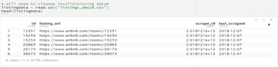

# Data Analysis Project Proposal

## Analysis of Airbnb data for Sydney, Australia

### Overview

Our proposal is to analyze Airbnb data for Sydney, Australia in order to understand how various predictors influence the rental price of the properties. Prices vary mostly on the basis of the types of property, rooms, the neighborhood, proximity to tourist spots etc.
However, we certainly cannot overlook other variables like number of beds, cleaning fee, number of nights as these factors help in selecting a particular Airbnb listing. We chose Sydney, Australia Airbnb data because it sounded like an interesting region to study and also the Airbnb data is sufficiently large, accurate and readily available to be both useful and timely to study.

**Why do we want to look at Airbnb data?**

In recent years, we have observed how the use of various collaborative platforms like Airbnb, Uber, Zipcar have become prevalent and how these platforms present more unique, personalized way of experiencing the world in a budget friendly manner. As a potential guest, one might wonder what factors govern the price for a property - whether the listed price is fair according to the facilities provided or the neighborhood it is in. In a similar manner, the potential owners might want to determine what should be an ideal `rental price` for the property and how they can improve/upgrade the property to gain more monetary benefits. 

Since its humble beginnings, Airbnb has made no secret of its heavy use of data science to build new product offerings, improve its service and capitalize on new marketing initiatives. Similarly, users and hosts rely on data science to gain better economic benefits. 

We have acquired our data from open data on Kaggle at: 
https://www.kaggle.com/tylerx/sydney-airbnb-open-data

Our primary dataset will be acquired from the listings_dec18.csv file. This data includes 96 columns and 36,663 rows of information. From the given variables, we believe that below mentioned variables are among the ones which have greatest importance:

 - 	neighbourhood - where in city is the Airbnb located, closer to offices or to tourist places as per the guest’s requirement
 - 	property_type - is it an apartment, a townhouse or a house
 - 	room_type - whether the listing is for a private room or the entire property
 - 	accommodates - how many people can stay at a time in the property
 - 	beds – how many beds are available to accommodate guests
 - 	bathrooms – number of bathrooms vary per the guests visiting
 - 	amenities – internet, parking, washer included 
 - 	host_is_superhost – hosts and property need to qualify under various matrices to be a superhost   
 - 	cleaning_fee     - since it adds on to the total final price 
 - 	number_of_reviews  - the properties with more reviews are generally booked early. 
 -      minimum_nights– what is the minimum number of nights that guest has to pay to rent the property     
                                                                                                             
We will pre-process the data to remove unused fields, missing or invalid information before analyzing with R. We chose Sydney, Australia Airbnb data because it sounded like an interesting region to study and also the Airbnb data is sufficiently large, accurate and readily available to be both useful and timely to study.
We’ve created an R markdown document BNBexplore.rmd to learn about the primary and reference datasets that we will be using. The following is a screen shot showing a load and header view of the data using `price` as a response variable.

We will use the **Explore** R-markdown document to explore and learn about the datasets before cleansing them to discard the unneeded data. Our overall objective will be to determine how Airbnb prices vary depending not only on the listed features of a rental, but when correlated against predictors from the surrounding cities.

